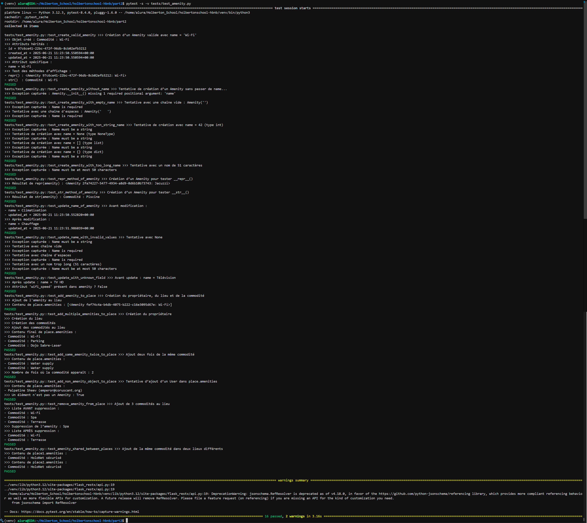

# HBnB - Backend API avec Flask

## Objectif du projet

Ce projet consiste à implémenter une application backend pour une API de gestion d’annonces de logements (similaire à AirBnB).  
L’objectif est de construire les couches **Présentation (API REST)** et **Logique Métier (Business Logic Layer)** en Python avec Flask, en suivant une architecture modulaire et les bonnes pratiques.

---

## Fonctionnalités principales

- Gestion des utilisateurs (User) : création, consultation, modification, suppression  
- Gestion des logements (Place) : création, consultation, modification, suppression, avec validation des données et gestion des relations (propriétaire, commodités)  
- Gestion des avis (Review) : création, consultation, modification, suppression, avec validation des liens utilisateur/logement  
- Gestion des commodités (Amenity) : création, consultation, modification (sans suppression pour l’instant)  
- Validation complète des données (ex : email, coordonnées GPS, prix)  
- Documentation automatique de l’API via Swagger (flask-restx)  
- Tests manuels (cURL/Postman) et automatisés

---

Objectifs pédagogiques:

- Structurer un projet :
Organiser le projet selon une architecture modulaire
Suivre les bonnes pratiques pour une application Python avec Flask
Créer les packages nécessaires aux couches présentation et logique métier

- implémenter la logique métier :
Développer les classes principales : User, Place, Review, Amenity
Définir les relations entre entités et leurs interactions
Appliquer le pattern Façade pour simplifier la communication entre les couches

- Construire les points d’accès API (endpoints) :
Implémenter les routes nécessaires pour les opérations CRUD sur les entités
Utiliser flask-restx pour définir et documenter l’API
Gérer la sérialisation des données (par ex. inclure first_name, last_name, etc. dans une réponse sur un Place)

- Tester et valider l’API :
Vérifier que chaque endpoint fonctionne et gère bien les cas limites
Utiliser Postman ou cURL pour tester les routes

- Comprendre la persistance en mémoire dans le projet HBnB
- Comprendre le motif de conception Façade (Facade Pattern) utilisé dans le projet HBnB

---

## Architecture du projet

Le projet est organisé en couches :

```c
hbnb/
├── app/
│   ├── __init__.py
│   ├── api/
│   │   ├── __init__.py
│   │   ├── v1/
│   │       ├── __init__.py
│   │       ├── users.py
│   │       ├── places.py
│   │       ├── reviews.py
│   │       ├── amenities.py
│   ├── models/
│   │   ├── __init__.py
│   │   ├── user.py
│   │   ├── place.py
│   │   ├── review.py
│   │   ├── amenity.py
│   ├── services/
│   │   ├── __init__.py
│   │   ├── facade.py
│   ├── persistence/
│       ├── __init__.py
│       ├── repository.py
├── run.py
├── config.py
├── requirements.txt
├── README.md
```

## Explication de chaque dossier et fichier : 

- hbnb/ (répertoire racine)
Contient tout le projet.

- app/
Dossier principal de l'application. Contient tous les modules métiers, API, persistance, etc.

- api/
Contient les endpoints de l’API.

- v1/
Version 1 de l’API REST (utile pour versionner l’API proprement).

Fichiers :
users.py : futur endpoint pour les utilisateurs.
places.py : futur endpoint pour les lieux.
reviews.py : futur endpoint pour les avis.
amenities.py : futur endpoint pour les équipements.

- models/
Contient les modèles métier (représentation des objets).
Fichiers :
user.py, place.py, review.py, amenity.py : chaque fichier représente une classe correspondant à une entité du projet.

- services/
Gère la logique métier et la coordination des opérations entre l’API et les données.

- facade.py :
Implémente le pattern Facade pour centraliser les appels vers les repositories.

Fournit des méthodes comme create_user, get_place, etc.

- __init__.py :
Initialise une instance unique (singleton) de HBnBFacade pour qu'elle soit accessible depuis toute l’application.

- persistence/
Gère la persistance des données (ici en mémoire, plus tard avec une vraie base).

- repository.py :
Définit une interface abstraite Repository et une implémentation InMemoryRepository.

Méthodes : add, get, update, delete, get_all, get_by_attribute.

- run.py
Point d’entrée de l'application.

Crée et lance l’instance Flask via create_app().

- config.py
Contient la configuration de l’application (clé secrète, mode debug...).

Prêt pour plusieurs environnements (development, default, etc.).

- requirements.txt
Liste les dépendances nécessaires au projet :
txt
Copier
Modifier
flask
flask-restx

- README.md
Sert à documenter

---

## Outils utilisés :

- Flask	Framework web léger pour créer les routes de l’API et gérer les requêtes HTTP.
- flask-restx	Extension de Flask pour structurer l’API REST, avec support de la documentation Swagger automatique.
- Postman ou cURL	Outils pour tester manuellement les endpoints de l’API.

---

## les tâches

## 0 Configuration du projet et initialisation des packages

**But :**
- Structurer proprement le projet

- Créer un répertoire de projet bien organisé, basé sur une architecture en couches (Présentation, Logique Métier, Persistance).

- Initialiser les packages Python :
Ajouter des fichiers __init__.py pour indiquer que chaque dossier est un package Python importable.

- Configurer Flask :
Créer l’application Flask de base avec un point d’entrée (run.py) et des endpoints vides (placeholders).

- Implémenter un dépôt en mémoire (InMemoryRepository) :
Fournir un système de stockage temporaire (non persistant), qui sera remplacé plus tard par une base de données.

- Mettre en place le pattern Facade :
Créer une classe intermédiaire qui centralise les appels entre la logique métier, la persistance, et l’API.

- Préparer un fichier de configuration :
Ajouter un fichier config.py pour gérer les paramètres d’environnement.

- Documenter le projet :
Écrire un README.md qui explique l’organisation du projet et comment le lancer.

- Lister et installer les dépendances :
Écrire un fichier requirements.txt et exécuter pip install -r requirements.txt.

- Tester le lancement de l’app :
Lancer python run.py pour vérifier que Flask fonctionne (même sans routes pour l’instant).

---

## 1 API de gestion d'annonces de logements

**But :**
- Créer une API en Python pour gérer des utilisateurs, des logements (places), des avis (reviews) et des services (amenities) — comme AirBnB.

**Fonctionnalités :**

- **Ajouter / modifier / supprimer un utilisateur**
  - `POST /api/v1/users/` → créer un nouvel utilisateur
  - `PUT /api/v1/users/<user_id>` → modifier un utilisateur existant
  - `DELETE /api/v1/users/<user_id>` → supprimer un utilisateur

- **Ajouter des logements**
  - `POST /api/v1/places/` → ajouter un logement avec :
    - un propriétaire (`user_id`)
    - des infos (nom, description, prix, latitude, longitude, nombre de chambres, etc.)

- **Ajouter des avis à un logement**
  - `POST /api/v1/places/<place_id>/reviews/` → ajouter un commentaire à un logement
    - Inclut l’auteur de l’avis (`user_id`), le texte et la date

- **Ajouter des services à un logement**
  - `POST /api/v1/places/<place_id>/amenities/` → lier un service (Wi-Fi, cuisine, etc.) à un logement

**En résumé :**
- crée une API web orientée objet qui :
 organise ses entités (user, place, etc.) en classes,
 applique des règles de validation,
 structure son code pour qu’il soit maintenable.

---
## 2 Implémenter les endpoints REST pour gérer les utilisateurs dans l’application HBnB

**But :**
- Ajouter deux routes API pour les utilisateurs :

- GET /api/v1/users/ → Retourne tous les utilisateurs.

- PUT /api/v1/users/<user_id> → Met à jour un utilisateur existant.

**Fonctionnalités :**

  ➤ `GET /api/v1/users/`  
  ➤ Retourne la liste complète des utilisateurs présents dans la base de données.
  ➤ `PUT /api/v1/users/<user_id>`  
  ➤ Met à jour les informations d’un utilisateur existant, comme son nom, email, etc.

---
## 3 Implémenter les Points de terminaison pour les commodités

**But :**
- Implémenter les endpoints API pour gérer les amenities (services/commodités) en créant, lisant, et mettant à jour les données. Pas de suppression (DELETE) dans cette étape.
- Business Logic Layer (facade.py)
- Dans la classe HBnBFacade du fichier services/facade.py, ajoute ces méthodes :
create_amenity(self, amenity_data) : Crée une nouvelle amenity.
get_amenity(self, amenity_id) : Récupère une amenity par son ID.
get_all_amenities(self) : Récupère la liste de toutes les amenities.
update_amenity(self, amenity_id, amenity_data) : Met à jour une amenity existante.

**Fonctionnalités :**
- **Créer une commodité** (`POST /api/v1/amenities/`)  
  ➤ Crée une nouvelle amenity à partir des données JSON envoyées (ex : nom)

- **Lire une commodité spécifique** (`GET /api/v1/amenities/<amenity_id>`)  
  ➤ Retourne les informations d’une amenity par son ID

- **Lire toutes les commodités** (`GET /api/v1/amenities/`)  
  ➤ Retourne la liste de toutes les commodités existantes

- **Mettre à jour une commodité** (`PUT /api/v1/amenities/<amenity_id>`)  
  ➤ Met à jour les données (ex : nom) d’une commodité existante

---
## 4 Implémenter les Endpoints Place

**But :**
- Valider les données (prix, coordonnées)

- Gérer les relations (propriétaire, équipements)

- Séparer la logique métier (facade) de la gestion des données (modèle) et de l’interface API (endpoints)

- Assurer que les clients peuvent créer, lire et mettre à jour des places facilement et sans erreur.

**Fonctionnalités :**

**➤ `POST /api/v1/places/`**
- Crée un nouveau logement (`Place`) à partir des données JSON envoyées.  
- Valide automatiquement les champs `price`, `latitude`, `longitude`.  
- Lie le logement à un propriétaire (`owner_id`) et à des commodités (`amenities`).  
- Retour : 201 (succès), 400 (erreur de validation).

---

**➤ `GET /api/v1/places/`** 
- Retourne la liste de tous les logements.  
- Chaque logement contient les infos de base : nom, description, prix, localisation, etc.  
- Retour : 200

---

**➤ `GET /api/v1/places/<place_id>`**  
- Récupère les détails complets d’un logement spécifique.  
- Inclut le propriétaire (`id`, `first_name`, `last_name`, `email`) et la liste des commodités (`id`, `name`).  
- Retour : 200 si trouvé,  404 si l’ID n’existe pas.

---

**➤ `PUT /api/v1/places/<place_id>`**  
- Met à jour un logement existant avec les données JSON fournies.  
- Valide tous les champs modifiés (`price`, `latitude`, `longitude`, etc.).  
- Peut également mettre à jour les relations (`owner_id`, `amenities`).  
- Retour : 200 (succès),  400 (erreur de validation),  404 (place non trouvée).

---
## 5 Implémentation des endpoints pour la gestion des avis 

**But :**
- Mettre en place les endpoints API pour gérer les avis (reviews) dans une application, avec toutes les opérations :

- Créer un avis (POST)

- Lire un ou plusieurs avis (GET)

- Modifier un avis (PUT)

- Supprimer un avis (DELETE)

**Fonctionnalités :**

**➤ `POST /api/v1/reviews/`**  
- Crée un nouvel avis (`Review`) lié à un utilisateur (`user_id`) et un lieu (`place_id`).  
- Valide les champs obligatoires : commentaire, note (par exemple de 0 à 5), `user_id`, `place_id`.  
- Retour :  
  - `201 Created` en cas de succès  
  - `400 Bad Request` si données invalides  
  - `404 Not Found` si utilisateur ou lieu inexistant

---

**➤ `GET /api/v1/reviews/`**  
- Retourne la liste complète de tous les avis.  
- Chaque avis contient : texte, note, auteur (`user`), lieu (`place`).  
- Retour :  
  - `200 OK`

---

**➤ `GET /api/v1/reviews/<review_id>`**  
- Récupère un avis spécifique par son identifiant.  
- Inclut les informations sur l’auteur (`user`) et le lieu (`place`).  
- Retour :  
  - `200 OK` si trouvé  
  - `404 Not Found` si avis inexistant

---

**➤ `PUT /api/v1/reviews/<review_id>`** 
- Met à jour un avis existant (texte, note, etc.).  
- Valide les données modifiées.  
- Retour :  
  - `200 OK` en cas de succès  
  - `400 Bad Request` si validation échouée  
  - `404 Not Found` si avis non trouvé

---

**➤ `DELETE /api/v1/reviews/<review_id>`**  
- Supprime un avis de la base de données.  
- Retour :  
  - `204 No Content` en cas de succès  
  - `404 Not Found` si avis inexistant

---
## 6 Implémentation des tests et validation des points de terminaison

**But :**
- Créer et exécuter des tests pour les endpoints développés.

- Implémenter une validation des données côté logique métier.

- Vérifier que chaque endpoint respecte les formats d’entrée/sortie, codes HTTP et règles de validation.

- Documenter les résultats des tests (tests réussis et échoués).

**Tests effectués :**
```c
Users Swagger/Postman Tests:
	POST
Creation : 201 = check
Invalid input data : 400 = check
Email already Registered: 400 = check

	GET_user_by_id
User retrieved successfully : 200 = check
User not found : 404 = check

	GET_user_by_email
User retrieved successfully : 200 = check
User not found : 404 = check

	GET_all_users
User retrieved successfully : 200 = check

	PUT
User updated successfully : 200 = check
Invalid input data : 400 = check
User not found : 404 = check
-------------------------------------------------------------------------

Places Swagger/Postman Tests:
	POST

Creation : 201 = check
Invalid input data : 400 = check
Owner Not found : 404 = check
Conflict: Title already used by this owner : 409 = check

	GET
	
List of places retrieved successfully : 200 = check

	GET by ID
	
Place details retrieved successfully : 200 = check
Place not found : 404 = check

	PUT
Place updated successfully : 200 = check
Invalid input data : 400 = check
Place not found : 404 = check
Conflict: Title already used by this owner : 409 = check

-------------------------------------------------------------------------

Amenities Swagger/Postman tests:

	POST	
Amenity successfully created : 201 = check
	
Invalid input data : 400 = check

	GET

List of amenities retrieved successfully : 200 = check

	GET by ID

Amenity details retrieved successfully : 200 = check

Amenity not found : 404 = check


	PUT
Amenity updated successfully : 200 = check

Invalid input data : 400 = check

Amenity not found : 404 = check

-------------------------------------------------------------------------

Users + Places + Amenities Tests:

	POST User + POST AMENITIES + POST PLACE (avec amenties)
Creation : 201 = check

	PUT PLACE (en modifiant les amenities)
Place updated successfully : 200 = check

	GET PLACE (pour voir si amenities apparaissent)
Place details retrieved successfully : 200 = check

	PUT AMENITIES
Amenity updated successfully : 200 = check
Invalid input data : 400 = check
Amenity not found : 404 = check

	GET AMENITIES
Amenity details retrieved successfully : 200 = check

	GET AMENITIES by ID
Amenity details retrieved successfully : 200 = check
Amenity not found : 404 = check

-------------------------------------------------------------------------
Users + Places + Amenities + Reviews Tests:

POST User + POST AMENITIES + POST PLACE + POST REVIEWS (avec amenties)
Creation : 201 = check

	PUT PLACE (en modifiant les amenities)
Place updated successfully : 200 = check

	GET PLACE (pour voir si amenities apparaissent)
Place details retrieved successfully : 200 = check

	GET REVIEWS
Amenity details retrieved successfully : 200 = check

	GET REVIEWS by Place
Amenity details retrieved successfully : 200 = check
Amenity not found : 404 = check

	GET REVIEWS by specific user
Amenity details retrieved successfully : 200 = check
Amenity not found : 404 = check

	GET REVIEWS by ID
Amenity details retrieved successfully : 200 = check
Amenity not found : 404 = check

	PUT REVIEWS
Amenity updated successfully : 200 = check
Invalid input data : 400 = check
Amenity not found : 404 = check

	DELETE REVIEWS by ID
Amenity details retrieved successfully : 200 = check
Amenity not found : 404 = check

-------------------------------------------------------------------------


```
<p align="center">
  
  
</p>

<p align="center">
  
  
</p>

---
## Instructions de lancement de l’API :
**Lancer depuis le terminal :**
```c
python3 part2/run.py
```

**Tu devrais voir :**
```c
 * Running on http://0.0.0.0:5000/
```

## Authors

[Benjamin Estrada](https://github.com/Aluranae)  
[Nina](https://github.com/ninaglss15)  
[Mylliah](https://github.com/Mylliah)
